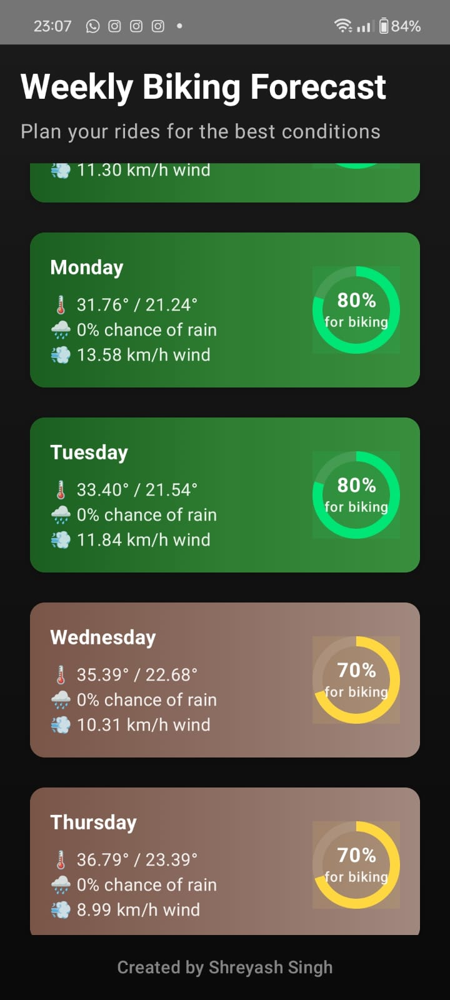

<h1 align="center">🏍️ Ride-Weather</h1>
<p align="center">
  <b>Plan Your Rides with the Best Weather Conditions 🌦️</b>  
</p>
<p align="center">
  
  
  
</p>

---

## 🚀 About the Project  
### **Your Smart Biking Companion!**  
**Ride-Weather** is an intelligent app that helps bikers find the **best days for riding** by analyzing real-time weather forecasts.  
No more surprise rain showers ruining your adventure—**plan ahead and ride smart!**  

---

## 🌟 Features  
✔️ **Weather-Based Ride Recommendations** – Get 🚦green (ideal) or ❌red (not recommended) ride days.  
✔️ **Live Weather Data** – Fetches real-time weather forecasts via API.  
✔️ **Smart Route Planning** – Suggests the best days & routes to avoid bad weather.  
✔️ **Custom Preferences** – Allows users to set their ideal riding conditions.  
✔️ **Ride Alerts & Notifications** – Get reminders for the best upcoming ride days!  

---

## 🎨 Screenshots  
<p align="center">
  
</p>

---

## 🛠️ Tech Stack  
📱 **Frontend:** React Native / Flutter (for mobile UI)  
⚙️ **Backend:** Node.js (for handling API calls)  
☁️ **Weather API:** OpenWeatherMap / WeatherAPI (for forecasts)  
💾 **Database (Optional):** Firebase / MongoDB (for user preferences & ride history)  

---

## 🏁 Getting Started  

### 🔥 1. Clone the Repository  
```bash
git clone https://github.com/yourusername/ride-weather.git
cd ride-weather
